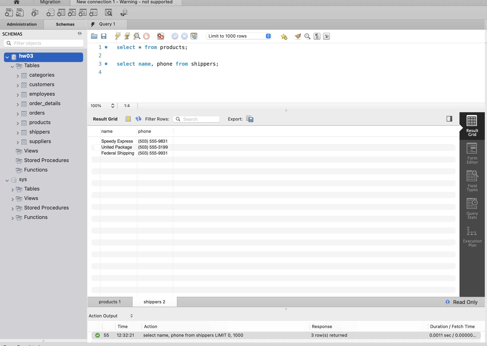
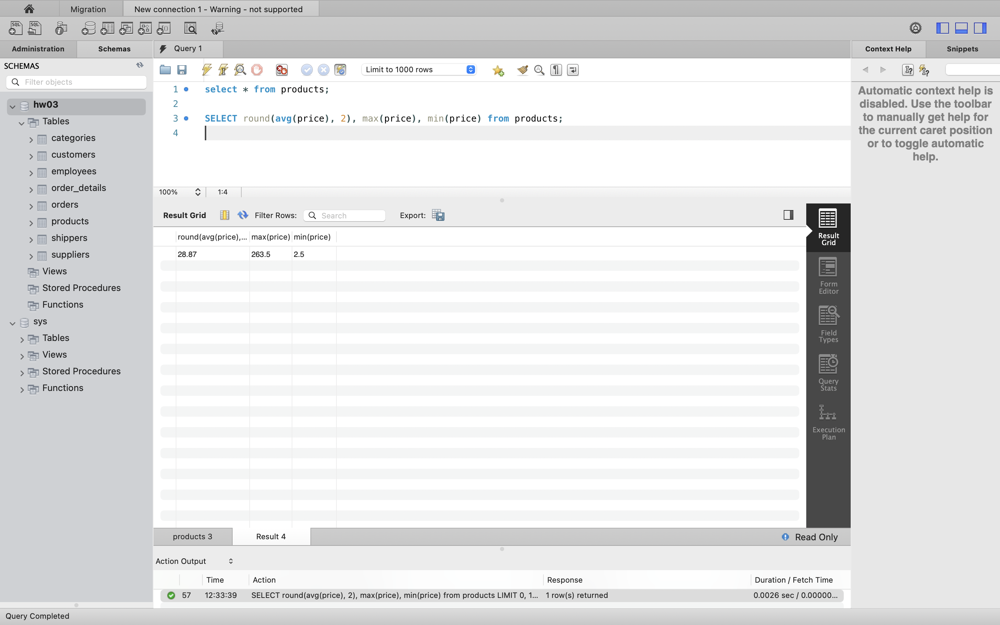
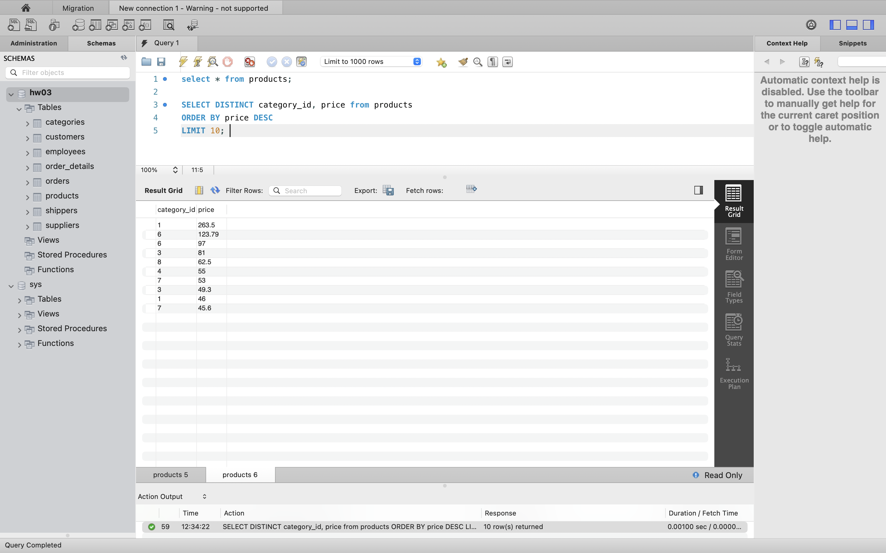
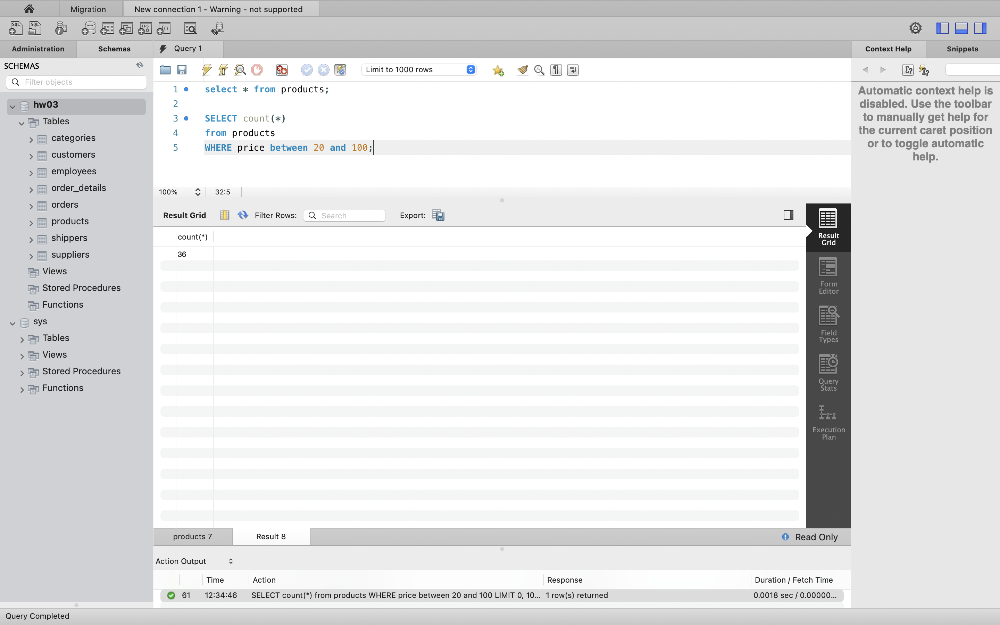
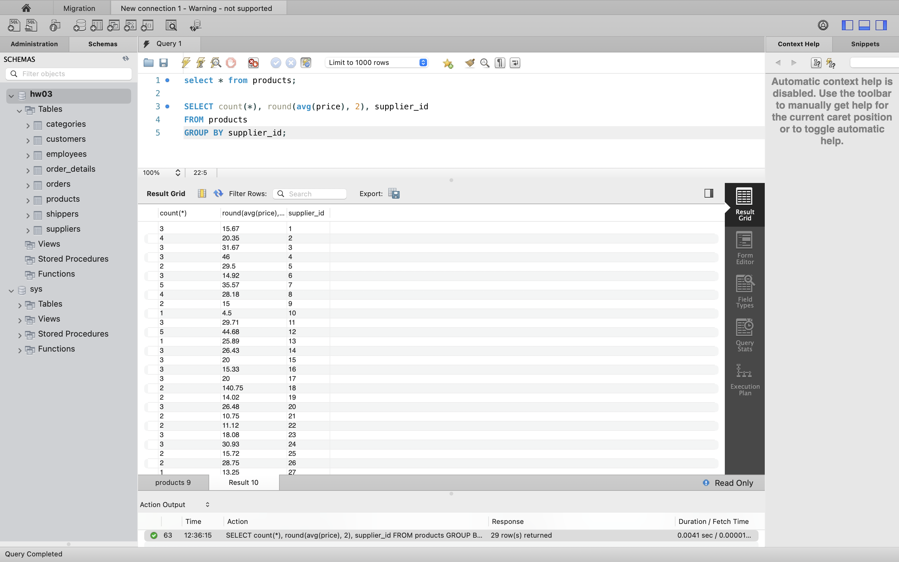

# SQL Commands Overview

This document explains a series of SQL commands used for querying and analyzing data from a database.

## 1. Retrieve All Rows and Specific Columns
```sql
select * from products;
select name, phone from shippers;
```

## 2. 

```
select * from products;
SELECT round(avg(price), 2), max(price), min(price) from products;```


## 3
SELECT DISTINCT category_id, price from products
ORDER BY price DESC
LIMIT 10; 



-- 4
SELECT count(*)
from products
WHERE price between 20 and 100;


-- 5
SELECT count(*), round(avg(price), 2), supplier_id
FROM products
GROUP BY supplier_id;


